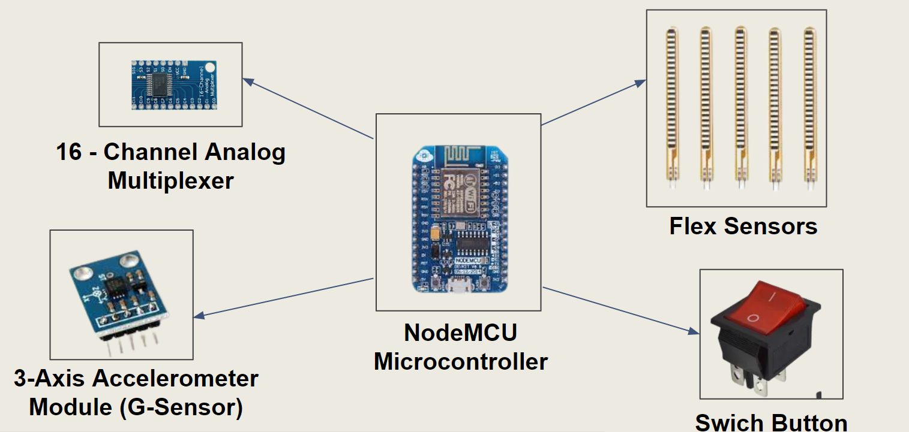
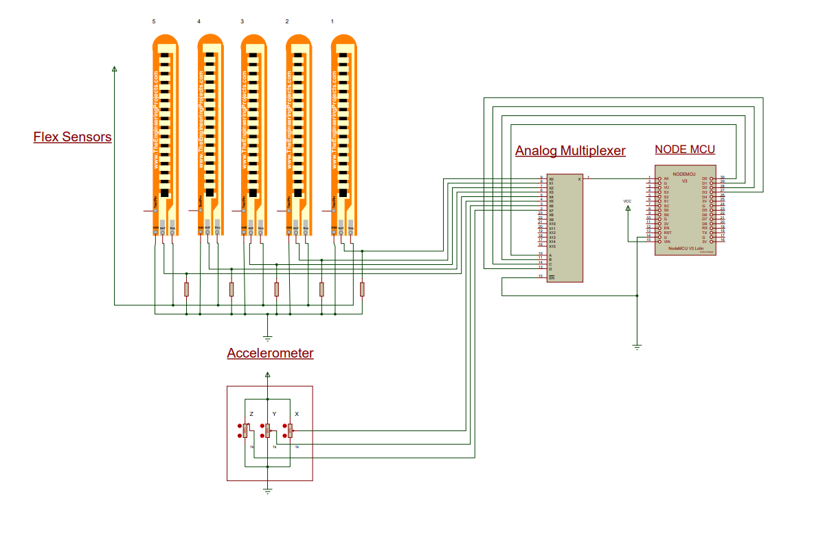
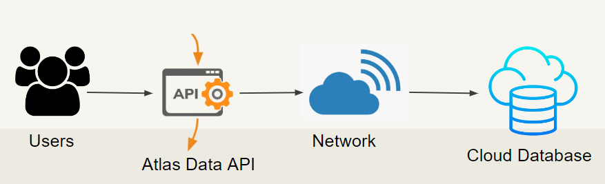
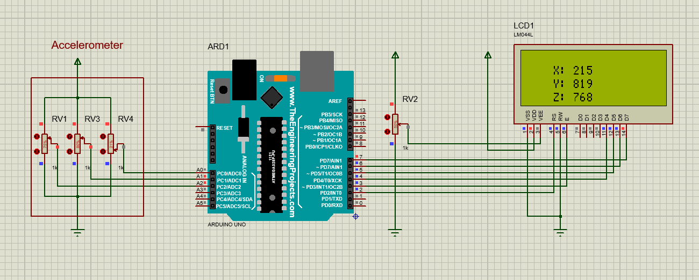
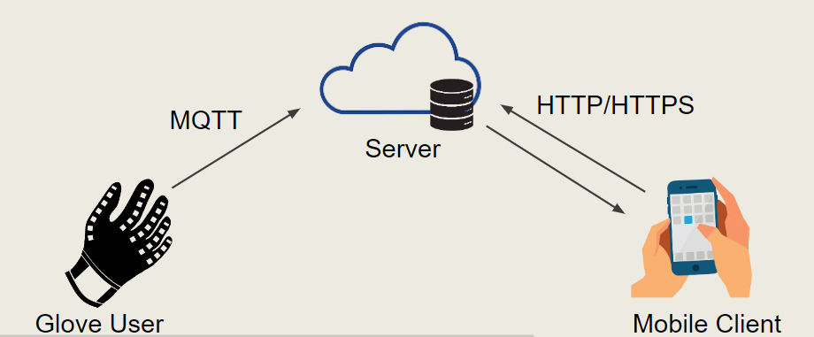

<!-- Image (photo/drawing of the final hardware) should be here -->

<!-- This is a sample image, to show how to add images to your page. To learn more options, please refer [this](https://projects.ce.pdn.ac.lk/docs/faq/how-to-add-an-image/) -->

<!--  -->

#### Table of Contents
1. [Introduction](#introduction)
2. [Solution Architecture](#solution-architecture )
3. [Hardware Design](#hardware-design)
4. [Software Design](#software-design)
5. [System Requirements](#system-requirements)
6. [Testing Plan](#testing)
7. [Detailed budget](#detailed-budget)
8. [Timeline](#timeline)
9. [Project Team](#team)
10. [Links](#links)

# Introduction
---

Currently, around 10% of the world population or roughly 650 million people live with a disability. Among them there are around 15% - 20%  deaf and dumb people. Most of them use sign language to communicate with the outside world. But certain percentage can understand this sign language. So, to overcome this problem we introduce a new product called smart glove which can sensor the movements of the hand. Those sensor values are converted into a text and a speech which can be used  by a third party to understand those sign language movements. Those who do not know how to use sign language can use our application to convert their audios to sign language.
Also this makes it easier for the average individual to comprehend what he is saying and respond appropriately. The ability to operate home appliances is a feature of this smart gloves that enables people with physical disabilities to live independently. The primary goal of the product is to create a dependable, user-friendly, lightweight smart hand glove system that can reduce barriers for persons with disabilities so they may participate in races.

### Why Sign Language ?

Communication is an important tool for every human being. Sign language is visual language extemely important communication native for many hard of hearing people. It also used by any people who want to communicate with such people and , also who can hear but can't talk. So sign languages bridge the gap between the disabled and normal person. 

### Why Smart Glove ?

Those people solely communicate with others through their hands and facial gestures. They typically find it difficult to communicate with others, therefore we focused this project to help them. The major goal is to help those people  by breaking down communication barriers so they are not restricted in a limited social circle and 
may express their feelings whenever they wish. Additionally, it would be beneficial in areas of health and education related to them. In our scope we focuse on hand sign language. Among them, American Sign Language (ASL) is one of the most widely used one. 

### What is Smart Glove ?

With the use of a smart glove, we can solve the issues that the disabled encounter, helps to understand what mute person is trying to say and reply accordingly. 

# Solution Architecture
---

### Our Solution

Smart Glove

  - Convert sign language to text
  - Detect signs accurately

  
Mobile app
  
  - Communicate between any of Glove users, Communicative users
  - Provide long distance communication

### Data flow and Storage

### Embedded System

### Circuit Diagram
This is the overall circuit diagram for the device. It has Node MCU microcontoller, 16 channel analog multiplexer, acclerometer and flex sensors. Since Node MCU microcontroller has a WiFi module, rather than using arduino board the selection was done to choose this microcontroller. So, the below diagram shows how flex sensor inputs and accelerometer inputs are taken by this microcontroller. The 16 channel analog multiplexer is used because the Node MCU microcontroller has only one analog input. So, n=it is needed to increase this to 8 for 5 flex sensors and 3 inputs of X,Y,Z from accelerometer. By considering the further improvements the decision was taken as 16 channel MUX rather than 8 channel MUX.

### Overall Control Flow

### Device Algorithm

### UI Designs and Control Flow

### Back End Control Flow

# Hardware Design
---

## Components

### Controller platform
- Node MCU Microcontroller
    

    

  

### Sensors
- 3 - Axis Accelerometer Module (G Sensor)

  

  

- Flex sensors

  

  

### Power supply
- Rechargeable battery
  

  

- Switch button (power ON)
  

  

## How Flex Sensor Works
It is used a resistors to get the flex sensor readings , according to the bending the output valu may changes 
When the bending is 0, the circuit diagram looks like this

This is an example of flex sensor measurement when there is some bending in the sensor(116 degrees)

## How Accelerometer Works

The below circuit diagram shows how accelerometer readings can be taken in 3D space. It outputs the X, Y, Z direction reading to the LCD display for the visualization. This is done for the testing of the accelerometer

### Hardware Testing
- Flex Sensor Testing
    Flex sensors are tested by connecting them to a separate circuit like above and check the functionality of those sensors
- Accelerometer Testing
    Accelerometer is tested by connecting it to a separate circuit like above and check the output via a LCD display
- Overall Hardware Product Testing
    Check the overall functionality of the device by sending messages to the mobile application. Examine the latency and the accuracy

# Software Design
---

### Front End Technology

Why?
  - onecode base for all platforms
  - hot reload - make changes in real time
  - rich libraries - quick loading, smooth app experience

### Back End Technologies

Why?
  - Full cloud based developer data platform
  - Flexible document schemas
  - High performance

Why?
  - Easily scalable (up or down)
  - Pay for what you use
  - Have complete control
  - Highly secure
  - Can access assets from anywhere in the world

### Network Technologies

### Software Testing

#### Front End Testing (Flutter test library)

Unit tests 
  
  - Check user sign up and sign in
      - Only eligible users can access
      - Check user credentials 

Integration tests

  - Verify app’s performance

#### Back End Testing  (Postman)

  - Check functionality of every API endpoint
      - Correct response data
      - Correct Status code

# System Requirements
---

Security

  - Encrypt data (Hash Coding)
  - Unique model number for each glove

Performance

  - Accuracy of the conversions
      - Sign language to text
      - Text / Voice to images
  - Minimum Latency

Power

  - Rechargeable batteries to power up
  - 3.3V supply voltage

# Testing Plan
---
## Software Testing

| Test                      | Method                       | Outcome                                |
| --------------------------|:----------------------------:|:--------------------------------------:|
| Authority Testing         | Flutter test library         | Prevent Unauthorized Access            | 
| API Testing               | POSTMAN                      | Accuracy of the requests               |
| Unit Testing              | Flutter test library         | Performance of each units in the App   |  
| Integration Testing       | Flutter test library         | Overall Performance of the App         |  

## Hardware Testing

| Test                      | Method                       | Outcome                                                       |
| --------------------------|:----------------------------:|:-------------------------------------------------------------:|
| Calibration Testing       | Manual calibration           | Ensure that all components are working fine                   | 
| Functionality Testing     | Manual Testing               | Accurately detect the sign each hardware checked separately   |
| Compatibility Testing     | Manual Testing               | Ensure that device is compatible with the system              |  
| Performance Testing       | Manual Testing               | Detect sign with minimum latency                              |  

# Detailed budget
---

| Item                      | Quantity  | Unit Cost (LKR)  | Total Cost (LKR)  |
| --------------------------|:---------:|:----------------:|------------------:|
| Node MCU microcontroller  |  1        | 2100             |  2100             |
| 16-Channel Analog Mux     |  1        |  540             |   540             |
| 3-Axis Accelerometer      |  1        |  800             |   800             |
| Flex Sensors              |  5        | 5000             |  2500             |
| Glove                     |  1        |  500             |   500             |
| Switch Button             |  1        |  120             |   120             |
| Rechargeable Battery      |  1        |  800             |   800             |
| Node MCU microcontroller  | 10        |   80             |   800             |
| Total Cost                |           |                  | 33660             |

# Timeline
---

What was achieved, future developments, commercialization plans

# Project Team
---

#### Project Supervisors

-  Dr. Isuru Nawinne, [isurunawinne@eng.pdn.ac.lk](mailto:name@email.com)
-  Dr. Mahanama Wickramasinghe, [mahanamaw@eng.pdn.ac.lk](mailto:name@email.com)

#### Project Developers

-  E/18/010, Avishka Abeywickrama, [e18010@eng.pdn.ac.lk](mailto:name@email.com)
-  E/18/156, Thakshila Jayathilake, [e18156@eng.pdn.ac.lk](mailto:name@email.com)
-  E/18/329, Nirasha Sewwandi, [e18329@eng.pdn.ac.lk](mailto:name@email.com)

# Links
---

- [Project Repository](https://github.com/cepdnaclk/{{ page.repository-name }}){:target="_blank"}
- [Project Page](https://cepdnaclk.github.io/{{ page.repository-name}}){:target="_blank"}
- [Department of Computer Engineering](http://www.ce.pdn.ac.lk/)
- [University of Peradeniya](https://eng.pdn.ac.lk/)

[//]: # (Please refer this to learn more about Markdown syntax)
[//]: # (https://github.com/adam-p/markdown-here/wiki/Markdown-Cheatsheet)
